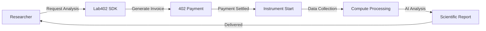

<div align="center">
  
  
  # Lab402+
  
  ### Autonomous Laboratory & Compute Protocol
  
  *Researchers remotely run lab analyses while renting compute power and AI expertise in a single 402 payment flow.*
  
  [](https://www.npmjs.com/package/@lab402/sdk)
  [](LICENSE)
  [](https://www.typescriptlang.org/)
</div>

<br/>

<div align="center">
  
  **One 402 Payment** • **Global Lab Access** • **AI Interpretation** • **Dynamic Compute**
  
</div>

---

## 🧬 What is Lab402+?

Lab402+ enables researchers to remotely run laboratory analyses (DNA sequencing, spectroscopy, microscopy) while simultaneously renting compute power and AI expertise—all paid for with a single HTTP 402 invoice.

**The workflow:**
1. Request analysis via SDK
2. Unified 402 invoice generated (instrument + compute + AI + storage)
3. Payment processed on Solana
4. Instrument starts automatically
5. Compute nodes process data
6. AI scientist generates report

---

## ⭐ Core Features

<table>
<tr>
<td width="50%">

### 🔬 Laboratory Access
- **6 Instruments**: DNA sequencer, spectroscopy, microscopy, mass-spec, NMR, X-ray
- **Global Network**: 5+ labs worldwide (MIT, Stanford, Oxford, Tokyo, Singapore)
- **Smart Routing**: Automatic lab selection by cost/speed/quality
- **Batch Processing**: Process 1000+ samples simultaneously
- **Volume Discounts**: Up to 30% off for large batches
- **Sample Tracking**: Full lifecycle management with barcodes
- **Quality Control**: QC checks and metrics tracking
- **7 AI Models**: Choose from specialized models for optimal results
- **Auto-Start**: Instruments begin after payment
- **403 Access Control**: Clearance-based permissions

</td>
<td width="50%">

### 🤖 AI & Compute
- **4 AI Models**: bio-gpt, chem-llm, lab-vision, generic
- **Dynamic GPU Leasing**: Auto-rent compute for processing
- **Scientific Reports**: Automated interpretation with graphs
- **Anomaly Detection**: AI identifies unexpected results

</td>
</tr>
</table>

---

## 📦 Installation

```bash
npm install @lab402/sdk
```

```bash
yarn add @lab402/sdk
```

```bash
pnpm add @lab402/sdk
```

---

## 🚀 Quick Start

```typescript
import { Lab402 } from '@lab402/sdk';

// Initialize with researcher identity
const lab = new Lab402({
  researcher: process.env.RESEARCHER_403_KEY,
  wallet: process.env.SOLANA_WALLET
});

// Request DNA sequencing with AI interpretation
const analysis = await lab.request({
  instrument: 'dna-sequencer',
  sample: { 
    type: 'genomic-dna', 
    concentration: '50 ng/μL' 
  },
  compute: { 
    gpu: 8, 
    vram: 48, 
    tier: 'performance' 
  },
  ai: { 
    model: 'bio-gpt',
    interpretation: true,
    visualization: true 
  }
});

// View unified invoice before starting
const invoice = analysis.getInvoice();
console.log('Total:', invoice.totalCost);
console.log('Breakdown:', {
  instrument: invoice.instrumentCost,
  compute: invoice.computeCost,
  ai: invoice.aiCost
});

// Start analysis (processes 402 payment)
await analysis.start();

// Run the analysis
await analysis.run();

// Get AI-generated report
const report = await analysis.getReport();
console.log('Summary:', report.summary);
console.log('Findings:', report.findings);
console.log('Confidence:', report.confidence);
```

---

## 🧪 Batch Processing

Process hundreds or thousands of samples simultaneously with automatic parallelization and volume discounts.

### Volume Discounts

| Samples | Discount | Savings on 100 samples @ $50 |
|---------|----------|------------------------------|
| 1-9 | 0% | $0 |
| 10-49 | 10% | $500 |
| 50-99 | 15% | $750 |
| 100-499 | 20% | $1,000 |
| 500-999 | 25% | $1,250 |
| 1000+ | 30% | $1,500 |

### Basic Batch

```typescript
const batch = await lab.createBatch({
  instrument: 'dna-sequencer',
  samples: [
    { id: 'sample-1', data: { type: 'genomic-dna' } },
    { id: 'sample-2', data: { type: 'genomic-dna' } },
    // ... 98 more samples
  ],
  compute: { gpu: 16, vram: 64 },
  ai: { model: 'bio-gpt', interpretation: true }
});

// Automatic 20% discount on 100 samples!
// Base: $5,000 → Final: $4,000 (save $1,000)

await batch.start();
```

### Progress Tracking

```typescript
batch.on('batch.progress', (event) => {
  const p = event.data.progress;
  console.log(`${p.percentage.toFixed(1)}% complete`);
  console.log(`${p.completed}/${p.total} samples`);
  console.log(`ETA: ${p.estimatedTimeRemaining}ms`);
});

batch.on('batch.sample.completed', (event) => {
  console.log(`✅ ${event.data.sampleId} done`);
});
```

### Batch Reports

```typescript
await batch.start();

const report = batch.generateReport();

console.log(`Total: ${report.totalSamples}`);
console.log(`Completed: ${report.completedSamples}`);
console.log(`Failed: ${report.failedSamples}`);
console.log(`Avg time: ${report.averageProcessingTime}ms`);
console.log(`Total cost: $${report.totalCost}`);

// Aggregate statistics
console.log(report.aggregateStatistics);
```

### Export to CSV

```typescript
const csv = batch.exportToCSV();

// Sample ID,Status,Processing Time (ms),Value1,Value2,Value3
// sample-1,completed,2341,45.2,23.1,67.8
// sample-2,completed,2156,43.8,24.5,65.2
// ...

// Save to file or send to external system
```

### Parallelism

```typescript
// Small batch: 10x parallelism
const small = await lab.createBatch({
  samples: Array(10), // 10 samples
  // Processes 10 at once
});

// Large batch: 100x parallelism
const large = await lab.createBatch({
  samples: Array(500), // 500 samples
  // Processes 100 at once
});

// Massive batch: 200x parallelism
const massive = await lab.createBatch({
  samples: Array(1000), // 1000 samples
  priority: 'high'
  // Processes 200 at once
});
```

### Priority Levels

```typescript
// Low priority: Half parallelism, lower cost
const lowBatch = await lab.createBatch({
  samples: samples,
  priority: 'low'
});

// Normal priority: Standard parallelism
const normalBatch = await lab.createBatch({
  samples: samples,
  priority: 'normal'
});

// High priority: Double parallelism
const highBatch = await lab.createBatch({
  samples: samples,
  priority: 'high'
});
```

### Batch Manager

```typescript
const batchManager = lab.getBatchManager();

// Get all batches
const batches = batchManager.getAllBatches();

// Get active batches
const active = batchManager.getActiveBatches();

// Get statistics
console.log(`Total samples: ${batchManager.getTotalSamplesProcessed()}`);
console.log(`Total cost: $${batchManager.getTotalCost()}`);
console.log(`Total savings: $${batchManager.getTotalSavings()}`);
```

### Real-World Example

```typescript
// Clinical trial: Analyze 500 patient samples
const clinicalBatch = await lab.createBatch({
  instrument: 'dna-sequencer',
  samples: patients.map(p => ({
    id: p.patientId,
    data: p.dnaSample,
    metadata: { cohort: 'trial-A', date: p.collectionDate }
  })),
  compute: { gpu: 32, vram: 128 },
  ai: { 
    model: 'bio-gpt', 
    interpretation: true,
    anomalyDetection: true 
  },
  priority: 'high'
});

// Cost comparison:
// Individual: 500 × $50 = $25,000
// Batch (25% discount): $18,750
// Savings: $6,250! 💰

await clinicalBatch.start();

const report = clinicalBatch.generateReport();
// Export for regulatory compliance
const csv = clinicalBatch.exportToCSV();
```

---

## 🤖 AI Model Selection

Choose from 7 specialized AI models to optimize your analysis for cost, accuracy, or speed.

### Available Models

| Model | Type | Price/Sample | Accuracy | Best For |
|-------|------|--------------|----------|----------|
| Bio-GPT 7B | General Bio | $0.50 | 94.5% | Routine analysis |
| Chem-BERT Base | Chemistry | $0.75 | 96.2% | Chemical analysis |
| Medical-Vision v4 | Imaging | $1.50 | 97.2% | Medical imaging |
| Protein-Fold v3 | Structural | $2.00 | 98.1% | Protein structures |
| Pathology-AI Pro | Pathology | $2.50 | 96.8% | Digital pathology |
| Genomics-LLM 70B | Genomics | $3.50 | 97.8% | Complex genomics |
| Drug-Discovery AI | Pharma | $5.00 | 95.5% | Drug development |

### Auto-Select Best Model

```typescript
// Let Lab402 choose the best model
const selection = lab.selectAIModel('dna-sequencer');

console.log(selection.model.name);       // "Bio-GPT 7B"
console.log(selection.reason);           // "Optimal balance of cost and performance"
console.log(selection.confidence);       // 94%
console.log(selection.model.pricing.perSample); // 0.50
```

### Select by Priority

```typescript
// Cost-optimized (cheapest)
const costOptimized = lab.selectAIModel(
  'dna-sequencer',
  undefined,
  'cost'
);
console.log(costOptimized.model.pricing.perSample); // $0.50

// Accuracy-optimized (most accurate)
const accuracyOptimized = lab.selectAIModel(
  'dna-sequencer',
  undefined,
  'accuracy'
);
console.log(accuracyOptimized.model.parameters.accuracy); // 97.8%
```

### Compare Models

```typescript
const comparison = lab.compareAIModels([
  'bio-gpt-7b',
  'genomics-llm-70b'
]);

console.log('Recommended:', comparison.recommended.name);
// "Bio-GPT 7B"

comparison.alternatives.forEach(alt => {
  console.log(`\n${alt.model.name}:`);
  console.log('Pros:', alt.pros);
  // ["3.3% more accurate", "32K context window"]
  console.log('Cons:', alt.cons);
  // ["$3.00 more expensive per sample"]
});
```

### Search & Filter

```typescript
// Find affordable models
const affordable = lab.searchAIModels({
  maxPrice: 1.00
});

// Find high-accuracy models
const accurate = lab.searchAIModels({
  minAccuracy: 96
});

// Find models with specific capabilities
const proteinModels = lab.searchAIModels({
  capabilities: ['protein structure']
});

// Combined filters
const ideal = lab.searchAIModels({
  maxPrice: 2.00,
  minAccuracy: 95,
  type: 'bio-gpt'
});
```

### Use in Analysis

```typescript
// Step 1: Select model
const selection = lab.selectAIModel(
  'dna-sequencer',
  'genomic-variant-analysis',
  'accuracy'
);

// Step 2: Create analysis with selected model
const analysis = await lab.requestAnalysis({
  instrument: 'dna-sequencer',
  sample: {
    id: 'sample-001',
    type: 'genomic-dna',
    data: { sequenceLength: 3000000 }
  },
  compute: {
    gpu: selection.model.requirements.minGPU,
    vram: selection.model.requirements.minVRAM
  },
  ai: {
    model: selection.model.id,
    interpretation: true,
    reportFormat: 'detailed'
  }
});

console.log(`Using: ${selection.model.name}`);
console.log(`Cost: $${analysis.invoice.amount.usd.toFixed(2)}`);
```

### Model Details

```typescript
const model = lab.getAIModel('bio-gpt-7b');

console.log(model.name);          // "Bio-GPT 7B"
console.log(model.description);   // "General-purpose biological..."
console.log(model.version);       // "2.0"
console.log(model.trainingData);  // "PubMed, GenBank, UniProt (2025)"

// Capabilities
model.capabilities.forEach(cap => {
  console.log(`  - ${cap}`);
});
// - DNA sequence analysis
// - Protein annotation
// - Gene expression interpretation
// ...

// Requirements
console.log(`GPU: ${model.requirements.minGPU}x`);      // 1x
console.log(`VRAM: ${model.requirements.minVRAM}GB`);   // 16GB
console.log(`RAM: ${model.requirements.minRAM}GB`);     // 32GB

// Parameters
console.log(`Size: ${model.parameters.size}`);                    // "7B"
console.log(`Context: ${model.parameters.contextWindow} tokens`); // 8192
console.log(`Accuracy: ${model.parameters.accuracy}%`);           // 94.5%
```

### Budget Optimization

```typescript
const budget = 100;        // $100 total budget
const samplesNeeded = 50;  // 50 samples to analyze
const maxPerSample = budget / samplesNeeded; // $2.00/sample

// Find models within budget
const budgetModels = lab.searchAIModels({
  maxPrice: maxPerSample
});

console.log(`Models within budget: ${budgetModels.length}`);

budgetModels.forEach(m => {
  const totalCost = m.pricing.perSample * samplesNeeded;
  console.log(`\n${m.name}:`);
  console.log(`  Per sample: $${m.pricing.perSample}`);
  console.log(`  Total: $${totalCost.toFixed(2)}`);
  console.log(`  Accuracy: ${m.parameters.accuracy}%`);
});

// Output:
// Bio-GPT 7B:
//   Per sample: $0.50
//   Total: $25.00
//   Accuracy: 94.5%
//
// Chem-BERT Base:
//   Per sample: $0.75
//   Total: $37.50
//   Accuracy: 96.2%
//
// Medical-Vision v4:
//   Per sample: $1.50
//   Total: $75.00
//   Accuracy: 97.2%
```

### Cost Analysis

```typescript
// Calculate costs for different volumes
const models = ['bio-gpt-7b', 'genomics-llm-70b', 'drug-discovery-ai'];

console.log('Cost Comparison:\n');

models.forEach(modelId => {
  const model = lab.getAIModel(modelId);
  
  console.log(`${model.name}:`);
  console.log(`  10 samples: $${(model.pricing.perSample * 10).toFixed(2)}`);
  console.log(`  100 samples: $${(model.pricing.perSample * 100).toFixed(2)}`);
  console.log(`  1000 samples: $${(model.pricing.perSample * 1000).toFixed(2)}`);
  console.log('');
});

// Output:
// Bio-GPT 7B:
//   10 samples: $5.00
//   100 samples: $50.00
//   1000 samples: $500.00
//
// Genomics-LLM 70B:
//   10 samples: $35.00
//   100 samples: $350.00
//   1000 samples: $3,500.00
```

### Use Cases

**Research Labs:**
- Bio-GPT 7B for routine analysis ($0.50/sample)
- Genomics-LLM for complex projects ($3.50/sample)
- Save 30-50% with strategic model selection

**Clinical Diagnostics:**
- Medical-Vision for imaging ($1.50/sample)
- Pathology-AI for tissue analysis ($2.50/sample)
- Prioritize accuracy over cost

**Pharmaceutical:**
- Drug-Discovery AI for R&D ($5.00/sample)
- Chem-BERT for compound screening ($0.75/sample)
- ROI-focused model selection

**High-Throughput:**
- Bio-GPT for initial screening ($0.50/sample)
- Protein-Fold for hits ($2.00/sample)
- Balance speed, cost, and accuracy

---

## 💰 Cost Optimizer

Lab402+'s multi-objective optimization engine automatically finds the most cost-effective configuration for your analysis.

### Quick Example

```javascript
// Find optimal configuration
const optimized = lab.optimizeCost({
  instrument: 'dna-sequencer',
  samples: 100,
  constraints: {
    maxCost: 3000,        // Budget limit
    minQuality: 4.0,      // Minimum quality (1-5)
    priority: 'cost'      // or 'speed', 'quality', 'balanced'
  }
});

console.log('Selected Lab:', optimized.lab.name);
console.log('Selected AI:', optimized.aiModel.name);
console.log('Total Cost:', optimized.totals.discountedCost);
console.log('Savings:', optimized.totals.totalSavings);
```

### Optimization Priorities

| Priority | Optimizes | Best For |
|----------|-----------|----------|
| **cost** | Lowest price | Budget-constrained projects |
| **speed** | Fastest turnaround | Urgent analyses |
| **quality** | Highest quality | Critical research |
| **balanced** | Optimal mix | General-purpose |

### What-If Scenarios

Compare different configurations side-by-side:

```javascript
const scenarios = lab.runWhatIf(baseRequest, [
  { name: 'Double samples', changes: { samples: 200 } },
  { name: 'High quality', changes: { priority: 'quality' } },
  { name: 'Rush job', changes: { priority: 'speed' } }
]);

scenarios.forEach(s => {
  console.log(`${s.name}: $${s.result.totals.discountedCost}`);
});

// Output:
// Double samples: $6,144
// High quality: $6,400
// Rush job: $5,280
```

### Savings Estimation

See how much you save vs worst-case scenario:

```javascript
const savings = lab.estimateSavings({
  instrument: 'dna-sequencer',
  samples: 100,
  constraints: { priority: 'cost' }
});

console.log('Worst case:', savings.worstCase.total);    // $8,000
console.log('Optimized:', savings.optimized.total);     // $3,072
console.log('You save:', savings.savings.absolute);     // $4,928
console.log('Percentage:', savings.savings.percentage); // 61.6%
```

### Price Comparison

Compare prices across all options:

```javascript
const comparison = lab.comparePrices({
  instrument: 'dna-sequencer',
  samples: 100,
  constraints: { priority: 'balanced' }
});

// Laboratory:
//   [ ] Tokyo Biotech - $40 (quality: 4.0)
//   [✓] Stanford BioLab - $48 (quality: 4.5)
//   [ ] MIT BioLab - $55 (quality: 5.0)
//
// AI Model:
//   [✓] Bio-GPT 7B - $50 (accuracy: 94.5%)
//   [ ] Genomics-LLM 70B - $350 (accuracy: 97.8%)
//
// Compute Tier:
//   [ ] standard - $48 (1 GPU)
//   [✓] performance - $144 (4 GPU)
//   [ ] extreme - $384 (8 GPU)
```

### Real-World Example

```javascript
// Clinical trial: 500 patient samples
// Budget: $20,000
// Need high quality + CLIA/CAP certification
// Deadline: 48 hours

const optimized = lab.optimizeCost({
  instrument: 'dna-sequencer',
  samples: 500,
  constraints: {
    maxCost: 20000,
    minQuality: 4.5,
    maxTime: '48h',
    priority: 'quality',
    requireCertifications: ['CLIA', 'CAP']
  }
});

console.log('Lab:', optimized.lab.name);              // Singapore BioLab
console.log('Quality:', optimized.totals.averageQuality); // 4.7/5
console.log('Cost:', optimized.totals.discountedCost);    // $18,750
console.log('Batch discount:', optimized.batch.discount); // 25%
console.log('Under budget:', 20000 - 18750);              // $1,250
console.log('ETA:', optimized.lab.eta);                   // 36h
```

### Cost Breakdown

Every optimization includes detailed breakdown:

```javascript
{
  lab: { id, name, cost, quality, eta, location },
  aiModel: { id, name, costPerSample, accuracy },
  compute: { tier, gpu, vram, costPerMs },
  batch: { samples, discount, savings },
  totals: {
    baseCost: 6400,           // Before discounts
    discountedCost: 5120,     // After 20% discount
    totalSavings: 1280,       // Amount saved
    estimatedTime: 7200000,   // 2 hours in ms
    averageQuality: 4.3       // Combined quality
  },
  alternatives: [...]         // Other good options
}
```

### Features

- **Multi-Objective Optimization** - Balance cost, speed, and quality
- **Automatic Lab Selection** - Best lab from global network
- **AI Model Optimization** - Optimal model for your use case
- **Batch Discounts** - 10-30% off for volume
- **What-If Scenarios** - Test different configurations
- **Savings Estimation** - See potential savings
- **Price Comparison** - Compare all options
- **Budget Constraints** - Enforce cost limits
- **Quality Requirements** - Minimum quality thresholds
- **Time Constraints** - Deadline enforcement
- **Location Preferences** - Prefer specific regions
- **Certification Requirements** - CLIA, CAP, ISO-9001, etc.

### Use Cases

- **Clinical Trials** - Optimize 500+ samples within budget
- **Research Labs** - Cost-effective routine analyses
- **Emergency** - Fast turnaround with acceptable quality
- **Budget Research** - Maximize samples within tight budgets
- **High-Throughput** - Large-scale screening campaigns

### Advanced Constraints

```javascript
const optimized = lab.optimizeCost({
  instrument: 'dna-sequencer',
  samples: 100,
  constraints: {
    maxCost: 5000,                          // Budget limit
    minQuality: 4.5,                        // Quality floor
    maxTime: '24h',                         // Deadline
    priority: 'balanced',                   // Strategy
    preferredLocations: ['US', 'EU'],       // Regions
    requireCertifications: ['CLIA', 'CAP']  // Certs
  }
});
```

### Savings by Batch Size

| Samples | Discount | Example (@ $50/sample) |
|---------|----------|------------------------|
| 1-9     | 0%       | $500 → $500 |
| 10-49   | 10%      | $2,500 → $2,250 |
| 50-99   | 15%      | $5,000 → $4,250 |
| 100-499 | 20%      | $10,000 → $8,000 |
| 500-999 | 25%      | $50,000 → $37,500 |
| 1000+   | 30%      | $100,000 → $70,000 |

💡 **Tip**: Always batch samples together to get volume discounts!

---

## 🔄 Data Pipeline - Laboratory Automation

Automate complex multi-step laboratory workflows with pipelines.

### Create Simple Pipeline

```typescript
const pipeline = lab.createPipeline('my-workflow')
  .addInstrument('dna-sequencer', { samples: 100 })
  .addAIAnalysis('genomics-llm', 'variant-calling')
  .addStorage('s3://results/genomics');

const result = await pipeline.execute();
console.log(`Pipeline completed in ${result.executionTime}ms`);
```

### Use Built-in Templates

```typescript
// Genomics Analysis: DNA sequencing → AI analysis → Storage
const genomics = lab.createPipelineFromTemplate('genomics-analysis', {
  samples: 100,
  quality: 'high',
  storageDestination: 's3://research/genomics'
});

await genomics.execute();
```

### Available Templates

```typescript
const templates = lab.listPipelineTemplates();
// Returns:
// - 'genomics-analysis' - Complete genomics workflow
// - 'drug-discovery' - Compound screening & prediction
// - 'quality-control' - Automated QC validation
// - 'batch-processing' - High-throughput processing
// - 'research-workflow' - Flexible research protocol
```

### Conditional Branching

```typescript
const pipeline = lab.createPipeline('quality-control')
  .addInstrument('spectroscopy', { samples: 50 })
  .addAIAnalysis('pathology-ai', 'quality-check')
  .addCondition('QC Check', (data) => {
    return data.results.qualityScore > 0.90;
  })
  .addCustom('Approve', async (context) => {
    return { approved: true, timestamp: Date.now() };
  })
  .addWebhook('https://api.example.com/qc/approved');

await pipeline.execute();
```

### Error Handling & Retries

```typescript
const pipeline = lab.createPipeline('robust-analysis')
  .addInstrument('mass-spec', { samples: 100 })
  .setTimeout(300000) // 5 minutes
  .setRetry({
    maxAttempts: 3,
    backoff: 'exponential',
    initialDelay: 2000,
    maxDelay: 10000
  })
  .onFailure('retry')
  .addAIAnalysis('chem-bert', 'analysis')
  .addStorage('s3://results');

// Pipeline will automatically retry on failure
const result = await pipeline.execute();
```

### Data Transformation

```typescript
const pipeline = lab.createPipeline('drug-discovery')
  .addInstrument('mass-spec', { samples: 50 })
  .addAIAnalysis('drug-discovery', 'efficacy-prediction')
  .addTransform((data) => {
    // Filter safe compounds
    const compounds = data.results.compounds;
    const safe = compounds.filter(c => 
      c.toxicity < 0.3 && c.efficacy > 0.7
    );
    
    return {
      safeCompounds: safe,
      totalAnalyzed: compounds.length,
      successRate: safe.length / compounds.length
    };
  }, 'Safety Filter')
  .addStorage('s3://drug-discovery/results');

await pipeline.execute();
```

### Parallel Processing

```typescript
const pipeline = lab.createPipeline('parallel-analysis')
  // Run 3 analyses simultaneously
  .addInstrument('spectroscopy', { samples: 100 })
  .addInstrument('microscopy', { samples: 100 })
  .addInstrument('mass-spec', { samples: 100 })
  .parallel('spectroscopy', 'microscopy', 'mass-spec')
  
  // Combine results
  .addTransform((data) => {
    return { combined: true, analysisCount: 3 };
  }, 'Combine Results')
  
  .addStorage('s3://parallel-results');

await pipeline.execute();
```

### Real-Time Monitoring

```typescript
const pipeline = lab.createPipeline('monitored-research')
  .addInstrument('dna-sequencer', { samples: 100 })
  .addAIAnalysis('genomics-llm', 'analysis')
  .addStorage('s3://results');

// Listen to events
pipeline.on('step.started', (event) => {
  console.log(`Starting: ${event.data.stepName}`);
});

pipeline.on('step.completed', (event) => {
  console.log(`Completed: ${event.data.stepName} (${event.data.duration}ms)`);
});

pipeline.on('step.failed', (event) => {
  console.log(`Failed: ${event.data.error}`);
});

pipeline.on('pipeline.completed', (event) => {
  console.log('Pipeline finished successfully!');
});

await pipeline.execute();
```

### Storage Integration

```typescript
// S3
pipeline.addStorage('s3://bucket/path', 'json');

// IPFS
pipeline.addStorage('ipfs://QmHash', 'json');

// Local filesystem
pipeline.addStorage('file:///path/to/results', 'csv');

// PostgreSQL
pipeline.addStorage('postgres://localhost/database', 'json');

// MongoDB
pipeline.addStorage('mongodb://localhost/db/collection', 'json');
```

### Webhook Callbacks

```typescript
pipeline
  .addInstrument('dna-sequencer', { samples: 100 })
  .addWebhook('https://api.example.com/notify', {
    method: 'POST',
    headers: {
      'Authorization': 'Bearer YOUR_TOKEN',
      'Content-Type': 'application/json'
    }
  });
```

### Custom Steps

```typescript
pipeline.addCustom('My Custom Step', async (context) => {
  // Access previous results
  const previousResult = context.variables.get('previous');
  
  // Your custom logic
  const processed = await myCustomFunction(previousResult);
  
  // Return data for next step
  return {
    processed: true,
    data: processed,
    timestamp: Date.now()
  };
});
```

### Complete Drug Discovery Example

```typescript
const pipeline = lab.createPipeline('drug-discovery')
  // Step 1: Mass Spectrometry
  .addInstrument('mass-spec', {
    samples: 50,
    priority: 'quality'
  })
  .setTimeout(2400000) // 40 minutes
  
  // Step 2: Compound Identification
  .addAIAnalysis('chem-bert', 'compound-identification')
  
  // Step 3: Efficacy Prediction
  .addAIAnalysis('drug-discovery', 'efficacy-prediction')
  
  // Step 4: Safety Analysis
  .addTransform((data) => {
    const compounds = data.results.compounds;
    const safe = compounds.filter(c => 
      c.toxicity < 0.3 && c.efficacy > 0.7
    );
    
    console.log(`Analyzed: ${compounds.length}`);
    console.log(`Safe candidates: ${safe.length}`);
    
    return {
      safeCompounds: safe,
      totalAnalyzed: compounds.length,
      successRate: safe.length / compounds.length
    };
  }, 'Safety Filter')
  
  // Step 5: Store Results
  .addStorage('s3://drug-discovery/results', 'json')
  
  // Step 6: Notify Team
  .addWebhook('https://api.example.com/notify/discovery')
  
  // Error handling
  .setRetry({ maxAttempts: 3, backoff: 'exponential' })
  .onFailure('retry');

// Execute pipeline
const result = await pipeline.execute();

console.log(`Status: ${result.status}`);
console.log(`Time: ${(result.executionTime / 1000 / 60).toFixed(1)} minutes`);
console.log(`Steps completed: ${result.stepsCompleted}/${result.stepsCompleted + result.stepsFailed}`);
```

### Custom Pipeline Template

```typescript
import { PipelineTemplates } from '@lab402/sdk';

// Register your custom template
PipelineTemplates.register({
  name: 'cancer-research',
  description: 'Cancer research analysis pipeline',
  version: '1.0.0',
  steps: [
    {
      name: 'Tissue Analysis',
      type: 'instrument',
      config: {
        instrument: 'microscopy',
        samples: 50,
        priority: 'quality'
      }
    },
    {
      name: 'Pathology AI',
      type: 'ai-analysis',
      config: {
        aiModel: 'pathology-ai',
        task: 'cancer-detection'
      }
    },
    {
      name: 'Treatment Prediction',
      type: 'ai-analysis',
      config: {
        aiModel: 'medical-vision',
        task: 'treatment-prediction'
      }
    },
    {
      name: 'Generate Report',
      type: 'storage',
      config: {
        destination: 's3://cancer-research/reports',
        format: 'pdf'
      }
    }
  ],
  tags: ['cancer', 'pathology', 'medical']
});

// Use your template
const pipeline = lab.createPipelineFromTemplate('cancer-research');
await pipeline.execute();
```

### Pipeline Features

**Step Types:**
- 🧪 `instrument` - Run laboratory instrument
- 🤖 `ai-analysis` - AI model analysis
- 🔄 `transform` - Data transformation
- ❓ `condition` - Conditional branching
- 💾 `storage` - Store results (S3/IPFS/DB)
- 🔗 `webhook` - HTTP callback
- ⚙️ `custom` - Custom function

**Error Handling:**
- ✅ Automatic retries with exponential backoff
- ⏱️ Configurable timeouts per step
- 🔁 Retry policies with max attempts
- 🛡️ Graceful failure handling

**Execution:**
- ⚡ Parallel step execution
- 📊 Real-time progress monitoring
- 🎯 Conditional branching
- 🔄 Data transformation between steps

**Use Cases:**
- 🧬 Automated genomics workflows
- 💊 Drug discovery screening
- ✅ Quality control validation
- 📦 Batch processing
- 🔬 Research protocols
- 🔁 Reproducible experiments

---

## 🔬 Sample Tracking & Metadata

Track samples through their entire lifecycle with barcodes, quality checks, and full audit trails.

### Register Samples

```typescript
const sample = lab.registerSample(
  'sample-001',
  'blood',
  {
    origin: 'Patient-A',
    collectionDate: Date.now(),
    storageConditions: '-80°C',
    handler: 'Dr. Smith',
    protocol: 'PROTO-2024-001',
    tags: ['clinical-trial', 'cohort-a'],
    customFields: {
      patientAge: 45,
      gender: 'F'
    }
  },
  barcode // Optional, auto-generated if not provided
);

console.log(sample.id);        // 'sample-001'
console.log(sample.barcode);   // 'LAB-ABC123-XYZ789'
console.log(sample.status);    // 'registered'
```

### Barcode System

```typescript
// Auto-generate barcode
const barcode = lab.getSampleTracker().generateBarcode('BLOOD');
// 'BLOOD-1K7X8M9-A3B5C7'

// Find by barcode
const sample = lab.getSampleByBarcode('BLOOD-1K7X8M9-A3B5C7');
```

### Status Tracking

```typescript
// Update sample status
lab.updateSampleStatus(
  'sample-001',
  'stored',
  'Tech-1',
  'Stored in freezer A3'
);

lab.updateSampleStatus(
  'sample-001',
  'in-preparation',
  'Tech-2',
  'Thawing for analysis'
);

lab.updateSampleStatus(
  'sample-001',
  'ready',
  'Tech-2'
);

lab.updateSampleStatus(
  'sample-001',
  'in-analysis',
  'Instrument-1'
);
```

### Sample History

```typescript
// Add custom events
lab.addSampleHistory(
  'sample-001',
  'transferred',
  'Tech-3',
  'Transferred to analysis room',
  'Lab-Room-5'
);

// View full history
const tracker = lab.getSampleTracker();
const history = tracker.getSampleHistory('sample-001');

history.forEach(event => {
  console.log(`${event.event}: ${event.details}`);
  console.log(`  Actor: ${event.actor}`);
  console.log(`  Location: ${event.location}`);
  console.log(`  Time: ${new Date(event.timestamp).toLocaleString()}`);
});
```

### Quality Control

```typescript
// Add QC check
lab.addQualityCheck(
  'sample-001',
  'QC-Inspector-1',
  true, // passed
  {
    purity: 98.5,
    concentration: 250,
    integrity: 9.2
  },
  'All metrics within acceptable range'
);

// Failed QC
lab.addQualityCheck(
  'sample-002',
  'QC-Inspector-1',
  false, // failed
  {
    purity: 75.0
  },
  'Purity below threshold'
);

// View QC history
const qcChecks = tracker.getQualityChecks('sample-001');
console.log(`Pass rate: ${qcChecks.filter(q => q.passed).length / qcChecks.length * 100}%`);
```

### Query Samples

```typescript
// By status
const ready = lab.querySamples({ status: 'ready' });
const inProgress = lab.querySamples({ 
  status: ['in-preparation', 'in-analysis'] 
});

// By type
const bloodSamples = lab.querySamples({ type: 'blood' });

// By tags
const cohortA = lab.querySamples({ tags: ['cohort-a'] });
const trials = lab.querySamples({ tags: ['clinical-trial'] });

// By origin
const patientA = lab.querySamples({ origin: 'Patient-A' });

// By date range
const recent = lab.querySamples({
  dateRange: {
    start: Date.now() - 7 * 24 * 60 * 60 * 1000, // 7 days ago
    end: Date.now()
  }
});

// By location
const room5 = lab.querySamples({ location: 'Lab-Room-5' });

// Combined filters
const specificSamples = lab.querySamples({
  type: 'blood',
  status: 'ready',
  tags: ['cohort-a'],
  origin: 'Patient-A'
});
```

### Statistics

```typescript
const stats = lab.getSampleTracker().getStatistics();

console.log(`Total samples: ${stats.total}`);
console.log(`By status:`, stats.byStatus);
// { registered: 5, stored: 10, ready: 8, in-analysis: 3, completed: 15 }

console.log(`By type:`, stats.byType);
// { blood: 20, tissue: 15, urine: 6 }

console.log(`QC pass rate: ${stats.qcPassRate.toFixed(1)}%`);
console.log(`Total QC checks: ${stats.totalQCChecks}`);
console.log(`Total analyses: ${stats.totalAnalyses}`);
```

### Export Data

```typescript
// Export single sample
const data = tracker.exportSampleData('sample-001');
// Returns JSON string with complete sample data

// Save to file or send to external system
fs.writeFileSync('sample-001.json', data);
```

### Real-World Example

```typescript
// Clinical trial workflow
const trial = 'TRIAL-2024-001';

// Register patient samples
for (let i = 0; i < 100; i++) {
  const sample = lab.registerSample(
    `sample-${i}`,
    'blood',
    {
      origin: `Patient-${i}`,
      collectionDate: Date.now(),
      protocol: trial,
      tags: ['clinical-trial', 'cohort-a']
    }
  );

  // Initial QC
  lab.addQualityCheck(
    sample.id,
    'QC-Team',
    Math.random() > 0.05, // 95% pass rate
    {
      volume: 5.0 + Math.random(),
      hemolysis: Math.random() * 10
    }
  );

  // Store
  lab.updateSampleStatus(sample.id, 'stored', 'Tech-1');
}

// Later: Find ready samples for analysis
const readySamples = lab.querySamples({
  status: 'ready',
  tags: ['clinical-trial']
});

// Process in batch
const batch = await lab.createBatch({
  samples: readySamples.map(s => ({
    id: s.id,
    data: s.metadata
  })),
  instrument: 'dna-sequencer'
});

await batch.start();

// Update all as completed
readySamples.forEach(s => {
  lab.updateSampleStatus(s.id, 'completed', 'System');
});

// Generate report
const stats = lab.getSampleTracker().getStatistics();
console.log(`Trial ${trial} completed:`);
console.log(`Samples: ${stats.total}`);
console.log(`QC Pass Rate: ${stats.qcPassRate}%`);
```

---

## 🌍 Multi-Lab Routing

Lab402+ automatically selects the best laboratory from a global network based on your requirements.

### Global Lab Network

| Lab | Location | Quality | Instruments | Certifications |
|-----|----------|---------|-------------|----------------|
| **MIT BioLab** | Boston, USA | ⭐⭐⭐⭐⭐ | DNA, Mass-Spec, NMR | ISO-9001, CLIA, CAP |
| **Stanford BioLab** | California, USA | ⭐⭐⭐⭐½ | DNA, Spectro, Microscopy | ISO-9001, CLIA |
| **Oxford Research** | Oxford, UK | ⭐⭐⭐⭐⭐ | DNA, X-ray, NMR | ISO-9001, UKAS |
| **Tokyo Biotech** | Tokyo, Japan | ⭐⭐⭐⭐ | Spectro, Microscopy, Mass-Spec | ISO-9001 |
| **Singapore BioLab** | Singapore | ⭐⭐⭐⭐⭐ | DNA, Microscopy, Spectro | ISO-9001, CLIA, CAP |

### Routing Strategies

```typescript
// 1. Cost-Optimized: Choose cheapest lab
routing: { strategy: 'cost-optimized', maxCost: 80 }

// 2. Fastest: Choose lab with lowest load
routing: { strategy: 'fastest' }

// 3. Highest Quality: Choose best-rated lab
routing: { strategy: 'highest-quality', minQuality: 4.5 }

// 4. Nearest: Choose closest lab
routing: { strategy: 'nearest' }

// 5. Balanced: Optimal mix of all factors
routing: { strategy: 'balanced' }
```

### Example: Automatic Lab Selection

```typescript
const analysis = await lab.request({
  instrument: 'dna-sequencer',
  sample: sampleData,
  routing: {
    strategy: 'cost-optimized',
    maxCost: 80.00,
    minQuality: 4,
    preferredLocations: ['US']
  }
});

// SDK automatically selected: Stanford BioLab ($48, Quality 4.5)
console.log('Selected:', analysis.selectedLab.name);
console.log('Cost:', analysis.getInvoice().totalCost);
```

### Compare Lab Pricing

```typescript
const pricing = lab.getLabPricing('dna-sequencer');

// Returns:
// [
//   { lab: 'Stanford', price: 48, quality: 4.5, eta: '1-2h' },
//   { lab: 'MIT', price: 55, quality: 5, eta: '30min' },
//   { lab: 'Oxford', price: 60, quality: 5, eta: '4h' }
// ]
```

### Fallback System

```typescript
routing: {
  strategy: 'fastest',
  fallback: [
    { lab: 'mit-biolab', priority: 1 },
    { lab: 'stanford-lab', priority: 2 }
  ]
}
// If MIT unavailable → automatically uses Stanford
```

### Advanced Filtering

```typescript
routing: {
  strategy: 'balanced',
  maxCost: 100.00,              // Budget limit
  minQuality: 4,                // Minimum 4/5 stars
  maxDistance: 5000,            // Within 5000km
  preferredLocations: ['US', 'EU'],  // Prefer these regions
  excludeLabs: ['lab-xyz'],     // Exclude specific labs
  requireCertifications: ['CLIA', 'CAP']  // Required certs
}
```

---

## 🔬 Supported Instruments

| Instrument | Description | Base Cost | Clearance |
|------------|-------------|-----------|-----------|
| **DNA Sequencer** | High-throughput genomic sequencing | $50.00 | Level 2 |
| **Spectroscopy** | UV-Vis, IR, Raman analysis | $10.00 | Level 1 |
| **Microscopy** | Confocal, electron, super-resolution | $15.00 | Level 1 |
| **Mass-Spec** | Mass spectrometry | $40.00 | Level 2 |
| **NMR** | Nuclear magnetic resonance | $60.00 | Level 2 |
| **X-ray Diffraction** | Crystallography | $80.00 | Level 3 |

---

## 🤖 AI Models

| Model | Specialization | Best For |
|-------|----------------|----------|
| **bio-gpt** | Molecular biology, genomics | DNA sequencing, gene analysis |
| **chem-llm** | Chemistry, spectroscopy | Chemical composition, reactions |
| **lab-vision** | Image analysis | Microscopy, visual inspection |
| **generic** | General scientific analysis | Multi-purpose interpretation |

---

## 💰 Unified 402 Invoice

Every analysis generates **one payment** that covers:

```typescript
{
  instrumentCost: 50.00,  // Lab equipment usage
  computeCost: 12.80,     // GPU processing time
  aiCost: 20.00,          // AI interpretation
  storageCost: 0.01,      // Data retention
  totalCost: 82.81        // Single payment
}
```

### Compute Pricing

| Tier | GPU Rate | AI Request | Storage |
|------|----------|------------|---------|
| **Standard** | $0.004/ms | $10.00 | $0.01/GB |
| **Performance** | $0.012/ms | $20.00 | $0.02/GB |
| **Extreme** | $0.032/ms | $40.00 | $0.04/GB |

---

## 📊 Usage Examples

### Basic Analysis (Spectroscopy)

```typescript
const analysis = await lab.request({
  instrument: 'spectroscopy',
  sample: { type: 'chemical-compound' }
});

await analysis.start();
await analysis.run();

const metrics = analysis.getMetrics();
console.log('Cost:', metrics.costAccumulated);
```

### With Compute & AI (DNA Sequencing)

```typescript
const sequencing = await lab.request({
  instrument: 'dna-sequencer',
  sample: sampleData,
  compute: { gpu: 8, vram: 48, tier: 'extreme' },
  ai: {
    model: 'bio-gpt',
    interpretation: true,
    visualization: true,
    anomalyDetection: true
  }
});

await sequencing.start();
await sequencing.run();

const report = await sequencing.getReport();
console.log('AI Analysis:', report.summary);
console.log('Findings:', report.findings);
console.log('Anomalies:', report.anomalies);
```

### Event Monitoring

```typescript
lab.on('analysis.requested', (e) => {
  console.log('Analysis requested:', e.data);
});

lab.on('payment.settled', (e) => {
  console.log('Payment processed:', e.data);
});

lab.on('ai.completed', (e) => {
  console.log('AI interpretation ready');
});
```

### Check Availability

```typescript
const instruments = await lab.getAvailableInstruments();

instruments.forEach(inst => {
  console.log(inst.instrument);
  console.log('  Available:', inst.available);
  console.log('  Location:', inst.location);
  console.log('  Capabilities:', inst.capabilities);
});
```

---

## 🔐 Access Control (HTTP 403)

Researchers must have verified identity with appropriate clearance:

**Clearance Levels:**
- **Level 1**: Basic instruments (spectroscopy, microscopy)
- **Level 2**: Advanced (DNA sequencer, mass-spec, NMR)
- **Level 3**: High-security (X-ray diffraction)

Identity verification happens automatically on initialization:

```typescript
const lab = new Lab402({ 
  researcher: '403-key' // Verified researcher identity
});
```

---

## 📄 AI Report Structure

AI-generated reports include:

```typescript
{
  analysisId: string;
  summary: string;              // Overall summary
  findings: string[];           // Key findings
  anomalies: string[];          // Detected anomalies
  visualizations?: string[];    // Graph URLs
  confidence: number;           // 0-1 confidence score
  recommendations: string[];    // Next steps
  rawData: any;                 // Raw analysis data
  generatedAt: number;          // Timestamp
}
```

---

## 🌍 Use Cases

<table>
<tr>
<td width="33%">

### 🔬 Remote Research
Run experiments from anywhere globally using world-class instruments

</td>
<td width="33%">

### 💡 Cost Optimization
Pay only for actual instrument time + compute used

</td>
<td width="33%">

### 🤖 AI Acceleration
Get expert interpretation without local AI expertise

</td>
</tr>
<tr>
<td width="33%">

### 💰 Lab Monetization
Earn by sharing idle equipment with global researchers

</td>
<td width="33%">

### 🤝 Collaborative Science
Multiple researchers access shared facilities

</td>
<td width="33%">

### ✅ Quality Assurance
AI detects anomalies and ensures data quality

</td>
</tr>
</table>

---

## 🛠️ Development

```bash
# Install dependencies
npm install

# Build
npm run build

# Watch mode
npm run dev

# Run tests
npm test

# Type checking
npm run typecheck
```

---

## 📂 Project Structure

```
Lab402/
├── lib/                    # TypeScript source
│   ├── Lab402.ts          # Main class
│   ├── Analysis.ts        # Analysis management
│   ├── Identity403.ts     # HTTP 403 identity
│   ├── Payment402.ts      # HTTP 402 payments
│   └── types.ts           # Type definitions
├── spec/                   # Tests
├── bin/                    # CLI executable
├── assets/                 # Logo and images
├── dist/                   # Build output
└── example.js             # Usage examples
```

---

## 🔄 Workflow



1. **Researcher authenticates** via HTTP 403
2. **Request analysis** with instrument + compute + AI
3. **Unified 402 invoice** generated
4. **Payment processed** on Solana
5. **Instrument starts** automatically
6. **Compute nodes** process data
7. **AI model** generates report
8. **Report delivered** to researcher

---

## 📋 CLI Usage

```bash
# View available instruments
lab402 instruments

# Check pricing
lab402 pricing

# Request analysis (interactive)
lab402 request

# Show help
lab402 help
```

**Environment variables:**
```bash
export RESEARCHER_403_KEY="your-researcher-identity"
export SOLANA_WALLET="your-solana-wallet"
```

---

## 🤝 Contributing

Contributions are welcome! Please open an issue or submit a pull request.

---

## 📄 License

MIT License - see [LICENSE](LICENSE) file for details.

---

<div align="center">
  
  **Built with 🧬 for autonomous science**
  
  <sub>Empowering researchers worldwide with unified lab access and AI-powered insights</sub>
  
</div>

---

## ⭐ Core Features

- **Unified 402 Invoice** — One payment covers analysis, compute, and AI interpretation
- **AI Pipeline Compiler** — AI determines which instruments & compute resources are needed
- **Dynamic Compute Leasing** — GPUs/TPUs auto-rent for data processing tasks
- **AI Scientific Reports** — Automated interpretation with graphs, anomalies, insights
- **403 Access Control** — Only authorized researchers can run specific experiments
- **Remote Global Laboratory Access** — Use world-class instruments from anywhere
- **Idle Lab Monetization** — Labs earn by leasing instruments and compute when unused

## 📦 Installation

```bash
npm install @lab402/sdk
```

```bash
yarn add @lab402/sdk
```

```bash
pnpm add @lab402/sdk
```

## 🚀 Quick Start

```typescript
import { Lab402 } from '@lab402/sdk';

// Initialize with researcher identity and Solana wallet
const lab = new Lab402({
  researcher: process.env.RESEARCHER_403_KEY,
  wallet: process.env.SOLANA_WALLET
});

// Request DNA sequencing with AI interpretation
const analysis = await lab.request({
  instrument: 'dna-sequencer',
  sample: { type: 'genomic-dna', concentration: '50 ng/μL' },
  compute: { gpu: 4, vram: 32, tier: 'performance' },
  ai: { 
    model: 'bio-gpt',
    interpretation: true,
    visualization: true 
  }
});

// Start analysis (processes unified 402 payment)
await analysis.start();

// Run the analysis
await analysis.run();

// Get AI-generated report
const report = await analysis.getReport();
console.log('Summary:', report.summary);
console.log('Findings:', report.findings);
console.log('Confidence:', report.confidence);
```

## 📖 Usage Examples

### Basic Analysis

```typescript
const lab = new Lab402({
  researcher: 'your-403-key',
  wallet: 'your-solana-wallet'
});

// Simple spectroscopy (no compute or AI)
const analysis = await lab.request({
  instrument: 'spectroscopy',
  sample: { type: 'chemical-compound' }
});

await analysis.start();
await analysis.run();

const metrics = analysis.getMetrics();
console.log('Cost:', metrics.costAccumulated);
console.log('Time:', metrics.totalTime);
```

### With Compute & AI

```typescript
// DNA Sequencing with GPU compute and AI interpretation
const sequencing = await lab.request({
  instrument: 'dna-sequencer',
  sample: sampleData,
  compute: {
    gpu: 8,
    vram: 48,
    tier: 'extreme'
  },
  ai: {
    model: 'bio-gpt',
    interpretation: true,
    visualization: true,
    anomalyDetection: true
  }
});

// View invoice before starting
const invoice = sequencing.getInvoice();
console.log('Total Cost:', invoice.totalCost);
console.log('Breakdown:');
console.log('  - Instrument:', invoice.instrumentCost);
console.log('  - Compute:', invoice.computeCost);
console.log('  - AI:', invoice.aiCost);
console.log('  - Storage:', invoice.storageCost);

await sequencing.start();
await sequencing.run();

// Get AI report
const report = await sequencing.getReport();
console.log('AI Analysis:', report.summary);
console.log('Findings:', report.findings);
console.log('Anomalies:', report.anomalies);
console.log('Visualizations:', report.visualizations);
```

### Event Handling

```typescript
lab.on('analysis.requested', (event) => {
  console.log('Analysis requested:', event.data);
});

lab.on('analysis.completed', (event) => {
  console.log('Analysis completed!');
});

lab.on('payment.settled', (event) => {
  console.log('Payment processed:', event.data);
});

lab.on('ai.completed', (event) => {
  console.log('AI interpretation ready');
});

lab.on('error', (event) => {
  console.error('Error:', event.data);
});
```

### Check Availability

```typescript
// Get available instruments
const instruments = await lab.getAvailableInstruments();

instruments.forEach(inst => {
  console.log(inst.instrument);
  console.log('  Available:', inst.available);
  console.log('  Location:', inst.location);
  console.log('  Capabilities:', inst.capabilities);
});

// Get pricing information
const pricing = await lab.getPricing();
console.log('Pricing tiers:', pricing);
```

### Cancel Analysis

```typescript
const analysis = await lab.request({ instrument: 'microscopy' });
await analysis.start();

// Cancel if needed (partial refund)
await analysis.cancel();
```

## 🔬 Supported Instruments

| Instrument | Description | Base Cost |
|------------|-------------|-----------|
| `dna-sequencer` | High-throughput DNA sequencing | $50.00 |
| `spectroscopy` | UV-Vis, IR, Raman spectroscopy | $10.00 |
| `microscopy` | Confocal, electron, super-resolution | $15.00 |
| `mass-spec` | Mass spectrometry analysis | $40.00 |
| `nmr` | Nuclear magnetic resonance | $60.00 |
| `x-ray-diffraction` | X-ray crystallography | $80.00 |

## 🤖 AI Models

| Model | Specialization | Use Case |
|-------|----------------|----------|
| `bio-gpt` | Molecular biology, genomics | DNA sequencing, gene analysis |
| `chem-llm` | Chemistry, spectroscopy | Chemical composition, reactions |
| `lab-vision` | Image analysis | Microscopy, visual inspection |
| `generic` | General scientific analysis | Multi-purpose interpretation |

## 💰 Pricing

### Compute Tiers

| Tier | GPU Rate | AI Request | Storage |
|------|----------|------------|---------|
| **Standard** | $0.004/ms | $10.00 | $0.01/GB |
| **Performance** | $0.012/ms | $20.00 | $0.02/GB |
| **Extreme** | $0.032/ms | $40.00 | $0.04/GB |

### Unified 402 Invoice

Every analysis generates a single invoice covering:
- **Instrument cost** (per analysis)
- **Compute cost** (GPU/CPU time)
- **AI cost** (interpretation + visualization)
- **Storage cost** (data retention)

## 🔐 Access Control (HTTP 403)

Researchers must have verified identity and appropriate clearance:

```typescript
// Clearance levels required:
// Level 1: Basic instruments (spectroscopy, microscopy)
// Level 2: Advanced (DNA sequencer, mass-spec, NMR)
// Level 3: High-security (X-ray diffraction)

// Identity verification is automatic on initialization
const lab = new Lab402({ 
  researcher: '403-key' // Must be valid researcher identity
});
```

## 📊 Analysis Metrics

```typescript
const metrics = analysis.getMetrics();

console.log(metrics.instrumentTime);    // Time on instrument (ms)
console.log(metrics.computeTime);       // GPU processing time (ms)
console.log(metrics.aiProcessingTime);  // AI analysis time (ms)
console.log(metrics.totalTime);         // Total elapsed time (ms)
console.log(metrics.costAccumulated);   // Total cost (USD)
console.log(metrics.dataGenerated);     // Data size (bytes)
console.log(metrics.status);            // Current status
```

## 📄 AI Report Structure

```typescript
interface AIReport {
  analysisId: string;
  summary: string;                // Overall summary
  findings: string[];             // Key findings
  anomalies: string[];            // Detected anomalies
  visualizations?: string[];      // Graph URLs
  confidence: number;             // 0-1 confidence score
  recommendations: string[];      // Next steps
  rawData: any;                   // Raw analysis data
  generatedAt: number;            // Timestamp
}
```

## 🧪 Development

```bash
# Install dependencies
npm install

# Build
npm run build

# Watch mode
npm run dev

# Run tests
npm test

# Type checking
npm run typecheck
```

## 📂 Project Structure

```
Lab402/
├── lib/                    # TypeScript source
│   ├── Lab402.ts          # Main class
│   ├── Analysis.ts        # Analysis management
│   ├── Identity403.ts     # HTTP 403 identity
│   ├── Payment402.ts      # HTTP 402 payments
│   └── types.ts           # Type definitions
├── spec/                   # Vitest tests
├── bin/                    # CLI executable
├── dist/                   # Build output (CJS + ESM)
└── example.js             # Usage examples
```

## 🔄 Workflow

1. **Researcher authenticates** via HTTP 403 identity
2. **Request analysis** with instrument + compute + AI requirements
3. **Unified 402 invoice** generated with total cost breakdown
4. **Payment processed** on Solana blockchain
5. **Instrument starts** analysis automatically
6. **Compute nodes** process data in real-time
7. **AI model** generates interpretation and visualizations
8. **Report delivered** with findings, anomalies, recommendations

## 🌍 Use Cases

- **Remote Research** — Run experiments from anywhere globally
- **Cost Optimization** — Pay only for actual instrument time + compute
- **AI Acceleration** — Get AI interpretation without local expertise
- **Lab Monetization** — Earn by sharing idle equipment
- **Collaborative Science** — Multiple researchers access shared facilities
- **Quality Assurance** — AI detects anomalies and ensures data quality

## 🤝 Contributing

Contributions are welcome! Please open an issue or submit a pull request.

## 📄 License

MIT License - see [LICENSE](LICENSE) file for details.

---

<div align="center">
  
  **Built with 🧬 for autonomous science**
  
  <sub>Empowering researchers worldwide with unified lab access and AI-powered insights</sub>
  
</div>
