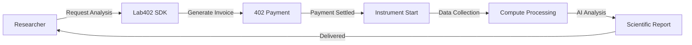

<div align="center">
  
  
  # Lab402+
  
  ### Autonomous Laboratory & Compute Protocol
  
  *Researchers remotely run lab analyses while renting compute power and AI expertise in a single 402 payment flow.*
  
  [](https://www.npmjs.com/package/@lab402/sdk)
  [](LICENSE)
  [](https://www.typescriptlang.org/)
</div>

<br/>

<div align="center">
  
  **One 402 Payment** • **Global Lab Access** • **AI Interpretation** • **Dynamic Compute**
  
</div>

---

## 🧬 What is Lab402+?

Lab402+ enables researchers to remotely run laboratory analyses (DNA sequencing, spectroscopy, microscopy) while simultaneously renting compute power and AI expertise—all paid for with a single HTTP 402 invoice.

**The workflow:**
1. Request analysis via SDK
2. Unified 402 invoice generated (instrument + compute + AI + storage)
3. Payment processed on Solana
4. Instrument starts automatically
5. Compute nodes process data
6. AI scientist generates report

---

## ⭐ Core Features

<table>
<tr>
<td width="50%">

### 🔬 Laboratory Access
- **6 Instruments**: DNA sequencer, spectroscopy, microscopy, mass-spec, NMR, X-ray
- **Global Network**: 5+ labs worldwide (MIT, Stanford, Oxford, Tokyo, Singapore)
- **Smart Routing**: Automatic lab selection by cost/speed/quality
- **Batch Processing**: Process 1000+ samples simultaneously
- **Volume Discounts**: Up to 30% off for large batches
- **Auto-Start**: Instruments begin after payment
- **403 Access Control**: Clearance-based permissions

</td>
<td width="50%">

### 🤖 AI & Compute
- **4 AI Models**: bio-gpt, chem-llm, lab-vision, generic
- **Dynamic GPU Leasing**: Auto-rent compute for processing
- **Scientific Reports**: Automated interpretation with graphs
- **Anomaly Detection**: AI identifies unexpected results

</td>
</tr>
</table>

---

## 📦 Installation

```bash
npm install @lab402/sdk
```

```bash
yarn add @lab402/sdk
```

```bash
pnpm add @lab402/sdk
```

---

## 🚀 Quick Start

```typescript
import { Lab402 } from '@lab402/sdk';

// Initialize with researcher identity
const lab = new Lab402({
  researcher: process.env.RESEARCHER_403_KEY,
  wallet: process.env.SOLANA_WALLET
});

// Request DNA sequencing with AI interpretation
const analysis = await lab.request({
  instrument: 'dna-sequencer',
  sample: { 
    type: 'genomic-dna', 
    concentration: '50 ng/μL' 
  },
  compute: { 
    gpu: 8, 
    vram: 48, 
    tier: 'performance' 
  },
  ai: { 
    model: 'bio-gpt',
    interpretation: true,
    visualization: true 
  }
});

// View unified invoice before starting
const invoice = analysis.getInvoice();
console.log('Total:', invoice.totalCost);
console.log('Breakdown:', {
  instrument: invoice.instrumentCost,
  compute: invoice.computeCost,
  ai: invoice.aiCost
});

// Start analysis (processes 402 payment)
await analysis.start();

// Run the analysis
await analysis.run();

// Get AI-generated report
const report = await analysis.getReport();
console.log('Summary:', report.summary);
console.log('Findings:', report.findings);
console.log('Confidence:', report.confidence);
```

---

## 🧪 Batch Processing

Process hundreds or thousands of samples simultaneously with automatic parallelization and volume discounts.

### Volume Discounts

| Samples | Discount | Savings on 100 samples @ $50 |
|---------|----------|------------------------------|
| 1-9 | 0% | $0 |
| 10-49 | 10% | $500 |
| 50-99 | 15% | $750 |
| 100-499 | 20% | $1,000 |
| 500-999 | 25% | $1,250 |
| 1000+ | 30% | $1,500 |

### Basic Batch

```typescript
const batch = await lab.createBatch({
  instrument: 'dna-sequencer',
  samples: [
    { id: 'sample-1', data: { type: 'genomic-dna' } },
    { id: 'sample-2', data: { type: 'genomic-dna' } },
    // ... 98 more samples
  ],
  compute: { gpu: 16, vram: 64 },
  ai: { model: 'bio-gpt', interpretation: true }
});

// Automatic 20% discount on 100 samples!
// Base: $5,000 → Final: $4,000 (save $1,000)

await batch.start();
```

### Progress Tracking

```typescript
batch.on('batch.progress', (event) => {
  const p = event.data.progress;
  console.log(`${p.percentage.toFixed(1)}% complete`);
  console.log(`${p.completed}/${p.total} samples`);
  console.log(`ETA: ${p.estimatedTimeRemaining}ms`);
});

batch.on('batch.sample.completed', (event) => {
  console.log(`✅ ${event.data.sampleId} done`);
});
```

### Batch Reports

```typescript
await batch.start();

const report = batch.generateReport();

console.log(`Total: ${report.totalSamples}`);
console.log(`Completed: ${report.completedSamples}`);
console.log(`Failed: ${report.failedSamples}`);
console.log(`Avg time: ${report.averageProcessingTime}ms`);
console.log(`Total cost: $${report.totalCost}`);

// Aggregate statistics
console.log(report.aggregateStatistics);
```

### Export to CSV

```typescript
const csv = batch.exportToCSV();

// Sample ID,Status,Processing Time (ms),Value1,Value2,Value3
// sample-1,completed,2341,45.2,23.1,67.8
// sample-2,completed,2156,43.8,24.5,65.2
// ...

// Save to file or send to external system
```

### Parallelism

```typescript
// Small batch: 10x parallelism
const small = await lab.createBatch({
  samples: Array(10), // 10 samples
  // Processes 10 at once
});

// Large batch: 100x parallelism
const large = await lab.createBatch({
  samples: Array(500), // 500 samples
  // Processes 100 at once
});

// Massive batch: 200x parallelism
const massive = await lab.createBatch({
  samples: Array(1000), // 1000 samples
  priority: 'high'
  // Processes 200 at once
});
```

### Priority Levels

```typescript
// Low priority: Half parallelism, lower cost
const lowBatch = await lab.createBatch({
  samples: samples,
  priority: 'low'
});

// Normal priority: Standard parallelism
const normalBatch = await lab.createBatch({
  samples: samples,
  priority: 'normal'
});

// High priority: Double parallelism
const highBatch = await lab.createBatch({
  samples: samples,
  priority: 'high'
});
```

### Batch Manager

```typescript
const batchManager = lab.getBatchManager();

// Get all batches
const batches = batchManager.getAllBatches();

// Get active batches
const active = batchManager.getActiveBatches();

// Get statistics
console.log(`Total samples: ${batchManager.getTotalSamplesProcessed()}`);
console.log(`Total cost: $${batchManager.getTotalCost()}`);
console.log(`Total savings: $${batchManager.getTotalSavings()}`);
```

### Real-World Example

```typescript
// Clinical trial: Analyze 500 patient samples
const clinicalBatch = await lab.createBatch({
  instrument: 'dna-sequencer',
  samples: patients.map(p => ({
    id: p.patientId,
    data: p.dnaSample,
    metadata: { cohort: 'trial-A', date: p.collectionDate }
  })),
  compute: { gpu: 32, vram: 128 },
  ai: { 
    model: 'bio-gpt', 
    interpretation: true,
    anomalyDetection: true 
  },
  priority: 'high'
});

// Cost comparison:
// Individual: 500 × $50 = $25,000
// Batch (25% discount): $18,750
// Savings: $6,250! 💰

await clinicalBatch.start();

const report = clinicalBatch.generateReport();
// Export for regulatory compliance
const csv = clinicalBatch.exportToCSV();
```

---

## 🌍 Multi-Lab Routing

Lab402+ automatically selects the best laboratory from a global network based on your requirements.

### Global Lab Network

| Lab | Location | Quality | Instruments | Certifications |
|-----|----------|---------|-------------|----------------|
| **MIT BioLab** | Boston, USA | ⭐⭐⭐⭐⭐ | DNA, Mass-Spec, NMR | ISO-9001, CLIA, CAP |
| **Stanford BioLab** | California, USA | ⭐⭐⭐⭐½ | DNA, Spectro, Microscopy | ISO-9001, CLIA |
| **Oxford Research** | Oxford, UK | ⭐⭐⭐⭐⭐ | DNA, X-ray, NMR | ISO-9001, UKAS |
| **Tokyo Biotech** | Tokyo, Japan | ⭐⭐⭐⭐ | Spectro, Microscopy, Mass-Spec | ISO-9001 |
| **Singapore BioLab** | Singapore | ⭐⭐⭐⭐⭐ | DNA, Microscopy, Spectro | ISO-9001, CLIA, CAP |

### Routing Strategies

```typescript
// 1. Cost-Optimized: Choose cheapest lab
routing: { strategy: 'cost-optimized', maxCost: 80 }

// 2. Fastest: Choose lab with lowest load
routing: { strategy: 'fastest' }

// 3. Highest Quality: Choose best-rated lab
routing: { strategy: 'highest-quality', minQuality: 4.5 }

// 4. Nearest: Choose closest lab
routing: { strategy: 'nearest' }

// 5. Balanced: Optimal mix of all factors
routing: { strategy: 'balanced' }
```

### Example: Automatic Lab Selection

```typescript
const analysis = await lab.request({
  instrument: 'dna-sequencer',
  sample: sampleData,
  routing: {
    strategy: 'cost-optimized',
    maxCost: 80.00,
    minQuality: 4,
    preferredLocations: ['US']
  }
});

// SDK automatically selected: Stanford BioLab ($48, Quality 4.5)
console.log('Selected:', analysis.selectedLab.name);
console.log('Cost:', analysis.getInvoice().totalCost);
```

### Compare Lab Pricing

```typescript
const pricing = lab.getLabPricing('dna-sequencer');

// Returns:
// [
//   { lab: 'Stanford', price: 48, quality: 4.5, eta: '1-2h' },
//   { lab: 'MIT', price: 55, quality: 5, eta: '30min' },
//   { lab: 'Oxford', price: 60, quality: 5, eta: '4h' }
// ]
```

### Fallback System

```typescript
routing: {
  strategy: 'fastest',
  fallback: [
    { lab: 'mit-biolab', priority: 1 },
    { lab: 'stanford-lab', priority: 2 }
  ]
}
// If MIT unavailable → automatically uses Stanford
```

### Advanced Filtering

```typescript
routing: {
  strategy: 'balanced',
  maxCost: 100.00,              // Budget limit
  minQuality: 4,                // Minimum 4/5 stars
  maxDistance: 5000,            // Within 5000km
  preferredLocations: ['US', 'EU'],  // Prefer these regions
  excludeLabs: ['lab-xyz'],     // Exclude specific labs
  requireCertifications: ['CLIA', 'CAP']  // Required certs
}
```

---

## 🔬 Supported Instruments

| Instrument | Description | Base Cost | Clearance |
|------------|-------------|-----------|-----------|
| **DNA Sequencer** | High-throughput genomic sequencing | $50.00 | Level 2 |
| **Spectroscopy** | UV-Vis, IR, Raman analysis | $10.00 | Level 1 |
| **Microscopy** | Confocal, electron, super-resolution | $15.00 | Level 1 |
| **Mass-Spec** | Mass spectrometry | $40.00 | Level 2 |
| **NMR** | Nuclear magnetic resonance | $60.00 | Level 2 |
| **X-ray Diffraction** | Crystallography | $80.00 | Level 3 |

---

## 🤖 AI Models

| Model | Specialization | Best For |
|-------|----------------|----------|
| **bio-gpt** | Molecular biology, genomics | DNA sequencing, gene analysis |
| **chem-llm** | Chemistry, spectroscopy | Chemical composition, reactions |
| **lab-vision** | Image analysis | Microscopy, visual inspection |
| **generic** | General scientific analysis | Multi-purpose interpretation |

---

## 💰 Unified 402 Invoice

Every analysis generates **one payment** that covers:

```typescript
{
  instrumentCost: 50.00,  // Lab equipment usage
  computeCost: 12.80,     // GPU processing time
  aiCost: 20.00,          // AI interpretation
  storageCost: 0.01,      // Data retention
  totalCost: 82.81        // Single payment
}
```

### Compute Pricing

| Tier | GPU Rate | AI Request | Storage |
|------|----------|------------|---------|
| **Standard** | $0.004/ms | $10.00 | $0.01/GB |
| **Performance** | $0.012/ms | $20.00 | $0.02/GB |
| **Extreme** | $0.032/ms | $40.00 | $0.04/GB |

---

## 📊 Usage Examples

### Basic Analysis (Spectroscopy)

```typescript
const analysis = await lab.request({
  instrument: 'spectroscopy',
  sample: { type: 'chemical-compound' }
});

await analysis.start();
await analysis.run();

const metrics = analysis.getMetrics();
console.log('Cost:', metrics.costAccumulated);
```

### With Compute & AI (DNA Sequencing)

```typescript
const sequencing = await lab.request({
  instrument: 'dna-sequencer',
  sample: sampleData,
  compute: { gpu: 8, vram: 48, tier: 'extreme' },
  ai: {
    model: 'bio-gpt',
    interpretation: true,
    visualization: true,
    anomalyDetection: true
  }
});

await sequencing.start();
await sequencing.run();

const report = await sequencing.getReport();
console.log('AI Analysis:', report.summary);
console.log('Findings:', report.findings);
console.log('Anomalies:', report.anomalies);
```

### Event Monitoring

```typescript
lab.on('analysis.requested', (e) => {
  console.log('Analysis requested:', e.data);
});

lab.on('payment.settled', (e) => {
  console.log('Payment processed:', e.data);
});

lab.on('ai.completed', (e) => {
  console.log('AI interpretation ready');
});
```

### Check Availability

```typescript
const instruments = await lab.getAvailableInstruments();

instruments.forEach(inst => {
  console.log(inst.instrument);
  console.log('  Available:', inst.available);
  console.log('  Location:', inst.location);
  console.log('  Capabilities:', inst.capabilities);
});
```

---

## 🔐 Access Control (HTTP 403)

Researchers must have verified identity with appropriate clearance:

**Clearance Levels:**
- **Level 1**: Basic instruments (spectroscopy, microscopy)
- **Level 2**: Advanced (DNA sequencer, mass-spec, NMR)
- **Level 3**: High-security (X-ray diffraction)

Identity verification happens automatically on initialization:

```typescript
const lab = new Lab402({ 
  researcher: '403-key' // Verified researcher identity
});
```

---

## 📄 AI Report Structure

AI-generated reports include:

```typescript
{
  analysisId: string;
  summary: string;              // Overall summary
  findings: string[];           // Key findings
  anomalies: string[];          // Detected anomalies
  visualizations?: string[];    // Graph URLs
  confidence: number;           // 0-1 confidence score
  recommendations: string[];    // Next steps
  rawData: any;                 // Raw analysis data
  generatedAt: number;          // Timestamp
}
```

---

## 🌍 Use Cases

<table>
<tr>
<td width="33%">

### 🔬 Remote Research
Run experiments from anywhere globally using world-class instruments

</td>
<td width="33%">

### 💡 Cost Optimization
Pay only for actual instrument time + compute used

</td>
<td width="33%">

### 🤖 AI Acceleration
Get expert interpretation without local AI expertise

</td>
</tr>
<tr>
<td width="33%">

### 💰 Lab Monetization
Earn by sharing idle equipment with global researchers

</td>
<td width="33%">

### 🤝 Collaborative Science
Multiple researchers access shared facilities

</td>
<td width="33%">

### ✅ Quality Assurance
AI detects anomalies and ensures data quality

</td>
</tr>
</table>

---

## 🛠️ Development

```bash
# Install dependencies
npm install

# Build
npm run build

# Watch mode
npm run dev

# Run tests
npm test

# Type checking
npm run typecheck
```

---

## 📂 Project Structure

```
Lab402/
├── lib/                    # TypeScript source
│   ├── Lab402.ts          # Main class
│   ├── Analysis.ts        # Analysis management
│   ├── Identity403.ts     # HTTP 403 identity
│   ├── Payment402.ts      # HTTP 402 payments
│   └── types.ts           # Type definitions
├── spec/                   # Tests
├── bin/                    # CLI executable
├── assets/                 # Logo and images
├── dist/                   # Build output
└── example.js             # Usage examples
```

---

## 🔄 Workflow



1. **Researcher authenticates** via HTTP 403
2. **Request analysis** with instrument + compute + AI
3. **Unified 402 invoice** generated
4. **Payment processed** on Solana
5. **Instrument starts** automatically
6. **Compute nodes** process data
7. **AI model** generates report
8. **Report delivered** to researcher

---

## 📋 CLI Usage

```bash
# View available instruments
lab402 instruments

# Check pricing
lab402 pricing

# Request analysis (interactive)
lab402 request

# Show help
lab402 help
```

**Environment variables:**
```bash
export RESEARCHER_403_KEY="your-researcher-identity"
export SOLANA_WALLET="your-solana-wallet"
```

---

## 🤝 Contributing

Contributions are welcome! Please open an issue or submit a pull request.

---

## 📄 License

MIT License - see [LICENSE](LICENSE) file for details.

---

<div align="center">
  
  **Built with 🧬 for autonomous science**
  
  <sub>Empowering researchers worldwide with unified lab access and AI-powered insights</sub>
  
</div>

---

## ⭐ Core Features

- **Unified 402 Invoice** — One payment covers analysis, compute, and AI interpretation
- **AI Pipeline Compiler** — AI determines which instruments & compute resources are needed
- **Dynamic Compute Leasing** — GPUs/TPUs auto-rent for data processing tasks
- **AI Scientific Reports** — Automated interpretation with graphs, anomalies, insights
- **403 Access Control** — Only authorized researchers can run specific experiments
- **Remote Global Laboratory Access** — Use world-class instruments from anywhere
- **Idle Lab Monetization** — Labs earn by leasing instruments and compute when unused

## 📦 Installation

```bash
npm install @lab402/sdk
```

```bash
yarn add @lab402/sdk
```

```bash
pnpm add @lab402/sdk
```

## 🚀 Quick Start

```typescript
import { Lab402 } from '@lab402/sdk';

// Initialize with researcher identity and Solana wallet
const lab = new Lab402({
  researcher: process.env.RESEARCHER_403_KEY,
  wallet: process.env.SOLANA_WALLET
});

// Request DNA sequencing with AI interpretation
const analysis = await lab.request({
  instrument: 'dna-sequencer',
  sample: { type: 'genomic-dna', concentration: '50 ng/μL' },
  compute: { gpu: 4, vram: 32, tier: 'performance' },
  ai: { 
    model: 'bio-gpt',
    interpretation: true,
    visualization: true 
  }
});

// Start analysis (processes unified 402 payment)
await analysis.start();

// Run the analysis
await analysis.run();

// Get AI-generated report
const report = await analysis.getReport();
console.log('Summary:', report.summary);
console.log('Findings:', report.findings);
console.log('Confidence:', report.confidence);
```

## 📖 Usage Examples

### Basic Analysis

```typescript
const lab = new Lab402({
  researcher: 'your-403-key',
  wallet: 'your-solana-wallet'
});

// Simple spectroscopy (no compute or AI)
const analysis = await lab.request({
  instrument: 'spectroscopy',
  sample: { type: 'chemical-compound' }
});

await analysis.start();
await analysis.run();

const metrics = analysis.getMetrics();
console.log('Cost:', metrics.costAccumulated);
console.log('Time:', metrics.totalTime);
```

### With Compute & AI

```typescript
// DNA Sequencing with GPU compute and AI interpretation
const sequencing = await lab.request({
  instrument: 'dna-sequencer',
  sample: sampleData,
  compute: {
    gpu: 8,
    vram: 48,
    tier: 'extreme'
  },
  ai: {
    model: 'bio-gpt',
    interpretation: true,
    visualization: true,
    anomalyDetection: true
  }
});

// View invoice before starting
const invoice = sequencing.getInvoice();
console.log('Total Cost:', invoice.totalCost);
console.log('Breakdown:');
console.log('  - Instrument:', invoice.instrumentCost);
console.log('  - Compute:', invoice.computeCost);
console.log('  - AI:', invoice.aiCost);
console.log('  - Storage:', invoice.storageCost);

await sequencing.start();
await sequencing.run();

// Get AI report
const report = await sequencing.getReport();
console.log('AI Analysis:', report.summary);
console.log('Findings:', report.findings);
console.log('Anomalies:', report.anomalies);
console.log('Visualizations:', report.visualizations);
```

### Event Handling

```typescript
lab.on('analysis.requested', (event) => {
  console.log('Analysis requested:', event.data);
});

lab.on('analysis.completed', (event) => {
  console.log('Analysis completed!');
});

lab.on('payment.settled', (event) => {
  console.log('Payment processed:', event.data);
});

lab.on('ai.completed', (event) => {
  console.log('AI interpretation ready');
});

lab.on('error', (event) => {
  console.error('Error:', event.data);
});
```

### Check Availability

```typescript
// Get available instruments
const instruments = await lab.getAvailableInstruments();

instruments.forEach(inst => {
  console.log(inst.instrument);
  console.log('  Available:', inst.available);
  console.log('  Location:', inst.location);
  console.log('  Capabilities:', inst.capabilities);
});

// Get pricing information
const pricing = await lab.getPricing();
console.log('Pricing tiers:', pricing);
```

### Cancel Analysis

```typescript
const analysis = await lab.request({ instrument: 'microscopy' });
await analysis.start();

// Cancel if needed (partial refund)
await analysis.cancel();
```

## 🔬 Supported Instruments

| Instrument | Description | Base Cost |
|------------|-------------|-----------|
| `dna-sequencer` | High-throughput DNA sequencing | $50.00 |
| `spectroscopy` | UV-Vis, IR, Raman spectroscopy | $10.00 |
| `microscopy` | Confocal, electron, super-resolution | $15.00 |
| `mass-spec` | Mass spectrometry analysis | $40.00 |
| `nmr` | Nuclear magnetic resonance | $60.00 |
| `x-ray-diffraction` | X-ray crystallography | $80.00 |

## 🤖 AI Models

| Model | Specialization | Use Case |
|-------|----------------|----------|
| `bio-gpt` | Molecular biology, genomics | DNA sequencing, gene analysis |
| `chem-llm` | Chemistry, spectroscopy | Chemical composition, reactions |
| `lab-vision` | Image analysis | Microscopy, visual inspection |
| `generic` | General scientific analysis | Multi-purpose interpretation |

## 💰 Pricing

### Compute Tiers

| Tier | GPU Rate | AI Request | Storage |
|------|----------|------------|---------|
| **Standard** | $0.004/ms | $10.00 | $0.01/GB |
| **Performance** | $0.012/ms | $20.00 | $0.02/GB |
| **Extreme** | $0.032/ms | $40.00 | $0.04/GB |

### Unified 402 Invoice

Every analysis generates a single invoice covering:
- **Instrument cost** (per analysis)
- **Compute cost** (GPU/CPU time)
- **AI cost** (interpretation + visualization)
- **Storage cost** (data retention)

## 🔐 Access Control (HTTP 403)

Researchers must have verified identity and appropriate clearance:

```typescript
// Clearance levels required:
// Level 1: Basic instruments (spectroscopy, microscopy)
// Level 2: Advanced (DNA sequencer, mass-spec, NMR)
// Level 3: High-security (X-ray diffraction)

// Identity verification is automatic on initialization
const lab = new Lab402({ 
  researcher: '403-key' // Must be valid researcher identity
});
```

## 📊 Analysis Metrics

```typescript
const metrics = analysis.getMetrics();

console.log(metrics.instrumentTime);    // Time on instrument (ms)
console.log(metrics.computeTime);       // GPU processing time (ms)
console.log(metrics.aiProcessingTime);  // AI analysis time (ms)
console.log(metrics.totalTime);         // Total elapsed time (ms)
console.log(metrics.costAccumulated);   // Total cost (USD)
console.log(metrics.dataGenerated);     // Data size (bytes)
console.log(metrics.status);            // Current status
```

## 📄 AI Report Structure

```typescript
interface AIReport {
  analysisId: string;
  summary: string;                // Overall summary
  findings: string[];             // Key findings
  anomalies: string[];            // Detected anomalies
  visualizations?: string[];      // Graph URLs
  confidence: number;             // 0-1 confidence score
  recommendations: string[];      // Next steps
  rawData: any;                   // Raw analysis data
  generatedAt: number;            // Timestamp
}
```

## 🧪 Development

```bash
# Install dependencies
npm install

# Build
npm run build

# Watch mode
npm run dev

# Run tests
npm test

# Type checking
npm run typecheck
```

## 📂 Project Structure

```
Lab402/
├── lib/                    # TypeScript source
│   ├── Lab402.ts          # Main class
│   ├── Analysis.ts        # Analysis management
│   ├── Identity403.ts     # HTTP 403 identity
│   ├── Payment402.ts      # HTTP 402 payments
│   └── types.ts           # Type definitions
├── spec/                   # Vitest tests
├── bin/                    # CLI executable
├── dist/                   # Build output (CJS + ESM)
└── example.js             # Usage examples
```

## 🔄 Workflow

1. **Researcher authenticates** via HTTP 403 identity
2. **Request analysis** with instrument + compute + AI requirements
3. **Unified 402 invoice** generated with total cost breakdown
4. **Payment processed** on Solana blockchain
5. **Instrument starts** analysis automatically
6. **Compute nodes** process data in real-time
7. **AI model** generates interpretation and visualizations
8. **Report delivered** with findings, anomalies, recommendations

## 🌍 Use Cases

- **Remote Research** — Run experiments from anywhere globally
- **Cost Optimization** — Pay only for actual instrument time + compute
- **AI Acceleration** — Get AI interpretation without local expertise
- **Lab Monetization** — Earn by sharing idle equipment
- **Collaborative Science** — Multiple researchers access shared facilities
- **Quality Assurance** — AI detects anomalies and ensures data quality

## 🤝 Contributing

Contributions are welcome! Please open an issue or submit a pull request.

## 📄 License

MIT License - see [LICENSE](LICENSE) file for details.

---

<div align="center">
  
  **Built with 🧬 for autonomous science**
  
  <sub>Empowering researchers worldwide with unified lab access and AI-powered insights</sub>
  
</div>
